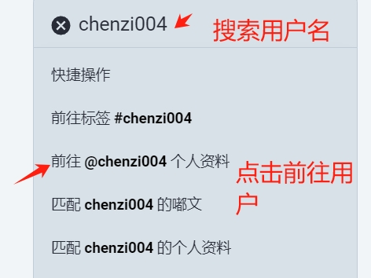
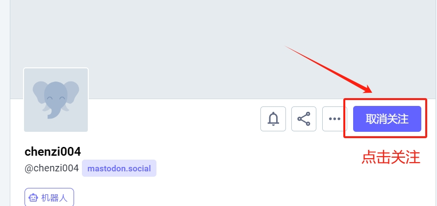

# 部署使用教程

## 1, Mastodon注册教程

**注册地址**: https://mastodon.social/
~~~
注册需要邮箱号码,建议使用 : https://www.mohmal.com/zh/inbox#     作为临时邮箱,可以多注册几个
~~~

### 1.1 用户相互关注
使用你的注册账号登陆,并且登陆过后,一定要 **相互关注**，如果双方不关注,则机器人不能获取到@的信息





## 2, 脚本安装

## 2.0 确定环境
- 确定你的环境是python=3.10的版本 
  - 如果你的环境不对,那么请你使用conda重新安装一个python3.10的环境
    ```shell
    conda create -n  py310 python=3.10.12 -y 
    ```

## 2.1, 安装依赖和当前包
~~~ /bash
pip3 install -r requirements.txt && pip3 install -e . 
~~~


## 3, 项目配置说明
项目配置文件在 `configs` 目录下,配置文件的说明如下:
- **ai/api.yaml** : 包含openai的api访问地址和请求地址
- **mastodon/user.yaml** : 包含mastodon的用户信息,包括用户名,密码,服务器地址等,如果你需要添加机器人的话,那么直接在上面添加即可,如果你不需要`prompt`的提示词,那么直接写明为null即可

## 4, 启动mastodon项目
启动文件在aiverse/run_mastodon.py中,直接使用 ```  rm -rf *.secret && python3 run_mastodon.py```  启动


## 5, 如何触发机器人

### 5.1, 直接使用@机器人来触发它


### 5.2 加上标签并且@机器人

