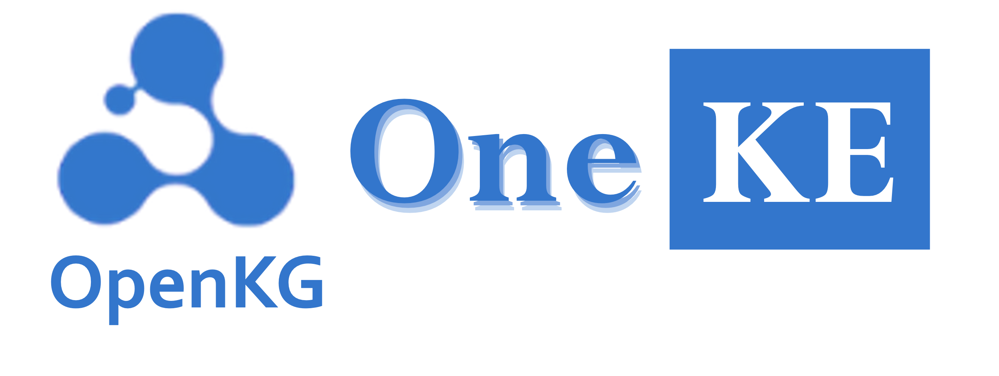
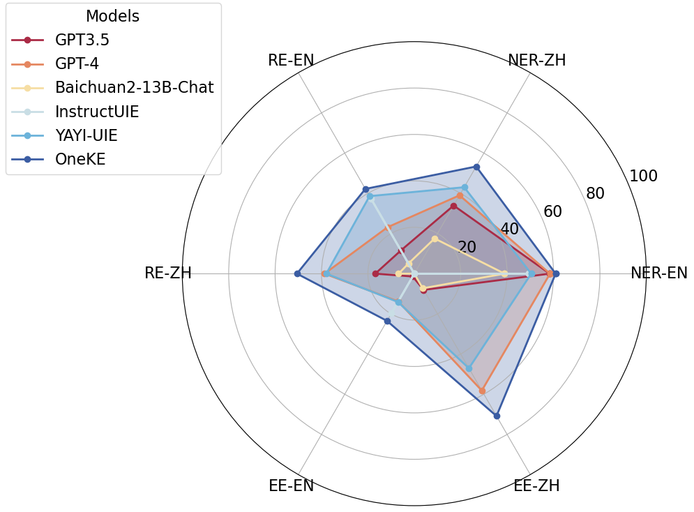

<p align="center">
    <a href="https://github.com/zjunlp/deepke"> </a>
<p>
<p align="center">  
    <a href="https://oneke.openkg.cn/">
        
    </a>
    <a href="https://pypi.org/project/deepke/#files">
        
    </a>
    <a href="https://github.com/zjunlp/DeepKE/blob/master/LICENSE">
        
    </a>
    <a href="http://zjunlp.github.io/DeepKE">
        
    </a>
</p>


<h1 align="center">
    <p>OneKE: A Bilingual Large Language Model for <br>Knowledge Extraction</p>
</h1>


- [What is OneKE?](#what-is-oneke)
- [How is OneKE trained?](#how-is-oneke-trained)
- [Getting Started with OneKE](#getting-started-with-oneke)
  - [Quick Start](#quick-start)
  - [Advanced Use of OneKE](#advanced-use-of-oneke)
  - [OneKE Instruction Format](#oneke-instruction-format)
  - [Conversion of OneKE Instruction Format](#conversion-of-oneke-instruction-format)
  - [Customized Schema Description Instructions](#customized-schema-description-instructions)
- [Evaluation](#evaluation)
- [Continue Training](#continue-training)
- [Citation](#citation)


## What is OneKE?

OneKE is a new bilingual knowledge extraction large model developed jointly by Zhejiang University and Ant Group, leveraging their years of accumulation in knowledge graph and natural language processing technology. Launched in 2024, the model employs schema-based polling instruction construction technology and is optimized to enhance the model's generalization capabilities for structured information extraction.


<p align="center" width="100%">
<a href="" target="_blank"></a>
</p>


## How is OneKE trained?
OneKE mainly focuses on schema-generalizable information extraction. Due to issues such as non-standard formats, noisy data, and lack of diversity in existing extraction instruction data, OneKE adopted techniques such as normalization and cleaning of extraction instructions, difficult negative sample collection, and schema-based batched instruction construction, as shown in the illustration. For more detailed information, refer to the paper "[IEPile: Unearthing Large-Scale Schema-Based Information Extraction Corpus](https://arxiv.org/abs/2402.14710) [[Github](https://github.com/zjunlp/IEPile)]".

The zero-shot generalization comparison results of OneKE with other large models are as follows:
* `NER-en`: CrossNER_AI, CrossNER_literature, CrossNER_music, CrossNER_politics, CrossNER_science
* `NER-zh`: WEIBONER, boson
* `RE-zh`: COAE2016, IPRE, SKE2020
* `RE-en`: FewRel, Wiki-ZSL
* `EE-en`: CrudeOilNews, WikiEvents, RAMS
* `EE-zh`: FewFC, CCF Law


<p align="center" width="50%">
<a href="" target="_blank"></a>
</p>


Here's the translation of the provided text into English:

## Getting Started with OneKE


### Quick Start

It is recommended to have at least **20GB of VRAM** for training and inferencing.


```python
import torch
from transformers import (
    AutoConfig,
    AutoTokenizer,
    AutoModelForCausalLM,
    GenerationConfig,
    BitsAndBytesConfig
)
device = torch.device("cuda" if torch.cuda.is_available() else "cpu")
model_path = 'zjunlp/OneKE'
config = AutoConfig.from_pretrained(model_path, trust_remote_code=True)
tokenizer = AutoTokenizer.from_pretrained(model_path, trust_remote_code=True)


# 4-bit Quantized OneKE
quantization_config=BitsAndBytesConfig(     
    load_in_4bit=True,
    llm_int8_threshold=6.0,
    llm_int8_has_fp16_weight=False,
    bnb_4bit_compute_dtype=torch.bfloat16,
    bnb_4bit_use_double_quant=True,
    bnb_4bit_quant_type="nf4",
)

model = AutoModelForCausalLM.from_pretrained(
    model_path,
    config=config,
    device_map="auto",  
    quantization_config=quantization_config,
    torch_dtype=torch.bfloat16,
    trust_remote_code=True,
)
model.eval()


system_prompt = '<<SYS>>\nYou are a helpful assistant. 你是一个乐于助人的助手。\n<</SYS>>\n\n'
sintruct = "{\"instruction\": \"You are an expert in named entity recognition. Please extract entities that match the schema definition from the input. Return an empty list if the entity type does not exist. Please respond in the format of a JSON string.\", \"schema\": [\"person\", \"organization\", \"else\", \"location\"], \"input\": \"284 Robert Allenby ( Australia ) 69 71 71 73 , Miguel Angel Martin ( Spain ) 75 70 71 68 ( Allenby won at first play-off hole )\"}"
sintruct = '[INST] ' + system_prompt + sintruct + '[/INST]'

input_ids = tokenizer.encode(sintruct, return_tensors="pt").to(device)
input_length = input_ids.size(1)
generation_output = model.generate(input_ids=input_ids, generation_config=GenerationConfig(max_length=1024, max_new_tokens=512, return_dict_in_generate=True))
generation_output = generation_output.sequences[0]
generation_output = generation_output[input_length:]
output = tokenizer.decode(generation_output, skip_special_tokens=True)

print(output)
```


### Advanced Use of OneKE


### OneKE Instruction Format
The instructions in OneKE are formatted in a dictionary-type string similar to JSON. It consists of three fields:
(1) **`'instruction'`**, which is the task description, specifies in natural language the role the model plays and the task to be completed;
(2) **`'schema'`**, a list of labels to be extracted, clearly indicates the key fields of the information to be extracted, reflecting the user's needs, and is dynamic and changeable;
(3) **`'input'`**, refers to the source text for information extraction.

Below are examples of instructions for various tasks:


<details>
  <summary><b>Named Entity Recognition (NER)</b></summary>

```json
{
    "instruction": "You are an expert specializing in entity extraction. Please extract entities that comply with the schema definition from the input; return an empty list for non-existent entity types. Please respond in the JSON string format.",
    "schema": ["Person Name", "Education", "Position", "Nationality"],
    "input": "Mr. Liu Zhijian: Born in 1956, Chinese nationality, no permanent residency abroad, member of the Communist Party, associate degree, senior economist."
}
```
</details>


<details>
  <summary><b>Relation Extraction (RE)</b></summary>

```json
{
    "instruction": "You are an expert specializing in relation extraction. Please extract relationship triples that comply with the schema definition from the input; return an empty list for non-existent relationships. Please respond in the JSON string format.",
    "schema": ["Father", "Husband", "Postal Code", "Mother"],
    "input": "Ding Long took out his life savings of $12,000, which without a doubt was a substantial amount at the end of the 19th century, plus Carpentier's donation, they both funded Columbia University's sinology research together."
}
```
</details>


<details>
  <summary><b>Knowledge Graph Construction (KGC)</b></summary>

```json
{
    "instruction": "You are an expert in structuring knowledge about graph entities. Based on the schema description of the input entity type, extract the corresponding entity instances and their property information from the text; do not output non-existent properties, return a list if there are multiple values for a property, and provide the output in a parseable json format.", 
    "schema": [
        {
            "entity_type": "Person", 
            "attributes": ["Chinese Name", "English Name", "Ancestral Home", "Date of Birth", "Place of Birth", "Occupation", "Alma Mater", "Works", "Awards"]
        }
    ], 
    "input": "Jay Chou (Jay Chou), born on January 18, 1979, in New Taipei City, Taiwan Province, ancestral home in Yongchun County, Quanzhou City, Fujian Province, Chinese pop singer, musician, actor, director, screenwriter, graduated from Tamkang High School. In 2000, he released his debut album 'Jay'. In 2001, he cemented his style of blending Eastern and Western music with the album 'Fantasy'. In 2002, he held ‘The One’ world tour; the same year, he won the Best Composer award at the 13th Taiwan Golden Melody Awards with the song 'Love Before the Century'."
}
```
</details>


<details>
  <summary><b>Event Extraction (EE)</b></summary>

```json
{
    "instruction": "You are an expert specializing in event extraction. Please extract events that match the defined schema from the input; return an empty list for non-existent events, NAN for non-existent arguments, and a list if there are multiple values for an argument. Please provide your response in JSON string format.",
    "schema": [
        {
            "event_type": "Finance/Trading - Interest Rate Hike",
            "trigger": true,
            "arguments": [
                "Time"
            ]
        },
        {
            "event_type": "Finance/Trading - Interest Rate Cut",
            "trigger": true,
            "arguments": [
                "Cut Magnitude"
            ]
        },
        {
            "event_type": "Finance/Trading - Price Increase",
            "trigger": true,
            "arguments": [
                "Price Raiser"
            ]
        },
        {
            "event_type": "Finance/Trading - Price Cut",
            "trigger": true,
            "arguments": [
                "Price Cutter",
                "Time"
            ]
        }
    ],
    "input": "AI risk control solution provider Vezetech secures tens of millions of dollars in Series C+ funding"
}
```
</details>


<details>
  <summary><b>Event Trigger Identification (EET)</b></summary>

```json
{
  "instruction": "You are an expert specializing in event trigger identification. Please extract the event types and triggers that match the defined schema from the input; return an empty list if the event type doesn't exist. Please provide your response in JSON string format.", 
  "schema": ["Organizational Relationship - Dissolve", "Organizational Relationship - Layoff", "Organizational Relationship - Dismiss", "Competition Behavior - Promotion"], 
  "input": "Nestlé lays off 4,000 employees: When the times leave you behind, they won't even say goodbye!"
}
```
</details>


<details>
  <summary><b>Event Argument Extraction (EEA)</b></summary>

```json
{
  "instruction": "You are an expert specializing in event argument extraction. Please extract the event arguments and their roles that match the defined schema from the input; return NAN or an empty dictionary for non-existent arguments, and a list if there are multiple values for an argument. Please provide your response in JSON string format.", 
  "schema": [{"event_type": "Organizational Relationship - Resignation/Departure", "arguments": ["Resigner", "Time", "Former Organization"]}], 
  "input": "Nestlé lays off 4,000 employees: When the times leave you behind, they won't even say goodbye!"
}
```
</details>


### Conversion of OneKE Instruction Format

**List of Instructions**:


```python
instruction_mapper = {
    'NERzh': "你是专门进行实体抽取的专家。请从input中抽取出符合schema定义的实体，不存在的实体类型返回空列表。请按照JSON字符串的格式回答。",
    'REzh': "你是专门进行关系抽取的专家。请从input中抽取出符合schema定义的关系三元组，不存在的关系返回空列表。请按照JSON字符串的格式回答。",
    'EEzh': "你是专门进行事件提取的专家。请从input中抽取出符合schema定义的事件，不存在的事件返回空列表，不存在的论元返回NAN，如果论元存在多值请返回列表。请按照JSON字符串的格式回答。",
    'EETzh': "你是专门进行事件提取的专家。请从input中抽取出符合schema定义的事件类型及事件触发词，不存在的事件返回空列表。请按照JSON字符串的格式回答。",
    'EEAzh': "你是专门进行事件论元提取的专家。请从input中抽取出符合schema定义的事件论元及论元角色，不存在的论元返回NAN或空字典，如果论元存在多值请返回列表。请按照JSON字符串的格式回答。",
    'KGzh': '你是一个图谱实体知识结构化专家。根据输入实体类型(entity type)的schema描述，从文本中抽取出相应的实体实例和其属性信息，不存在的属性不输出, 属性存在多值就返回列表，并输出为可解析的json格式。',
    'NERen': "You are an expert in named entity recognition. Please extract entities that match the schema definition from the input. Return an empty list if the entity type does not exist. Please respond in the format of a JSON string.",
    'REen': "You are an expert in relationship extraction. Please extract relationship triples that match the schema definition from the input. Return an empty list for relationships that do not exist. Please respond in the format of a JSON string.",
    'EEen': "You are an expert in event extraction. Please extract events from the input that conform to the schema definition. Return an empty list for events that do not exist, and return NAN for arguments that do not exist. If an argument has multiple values, please return a list. Respond in the format of a JSON string.",
    'EETen': "You are an expert in event extraction. Please extract event types and event trigger words from the input that conform to the schema definition. Return an empty list for non-existent events. Please respond in the format of a JSON string.",
    'EEAen': "You are an expert in event argument extraction. Please extract event arguments and their roles from the input that conform to the schema definition, which already includes event trigger words. If an argument does not exist, return NAN or an empty dictionary. Please respond in the format of a JSON string.", 
    'KGen': 'You are an expert in structured knowledge systems for graph entities. Based on the schema description of the input entity type, you extract the corresponding entity instances and their attribute information from the text. Attributes that do not exist should not be output. If an attribute has multiple values, a list should be returned. The results should be output in a parsable JSON format.',
}
```


Recommended **Split Numbers** for Each Task:


```python
split_num_mapper = {
    'NER':6, 'RE':4, 'EE':4, 'EET':4, 'EEA':4, 'KG':1
}
```


Since predicting all schemas in the label set at once is too challenging and not easily scalable, OneKE uses a batched approach during training. It divides the number of schemas asked in the instructions, querying a fixed number of schemas at a time. Hence, if the label set of a piece of data is too long, it will be split into multiple instructions that the model will address in turns.


**Schema Format**:


```python
NER: ["Person Name", "Education", "Position", "Nationality"]   # List of strings
RE: ["Father", "Husband", "Postal Code", "Mother"]   # List of strings
EE: [{"event_type": "Finance/Trading - Interest Rate Hike", "trigger": True, "arguments": ["Time"]}, {"event_type": "Finance/Trading - Interest Rate Cut", "trigger": True, "arguments": ["Cut Magnitude"]}]  # List of dictionaries, "event_type" is a string, "trigger" is a bool, "arguments" is a list
EET: ["Organizational Relationship - Dissolution", "Organizational Relationship - Layoff", "Organizational Relationship - Dismissal", "Competition Behavior - Advancement"]    # List of strings
EEA: [{"event_type": "Finance/Trading - Interest Rate Hike", "arguments": ["Time"]}, {"event_type": "Finance/Trading - Interest Rate Cut", "arguments": ["Cut Magnitude"]}]  # List of dictionaries, "event_type" is a string, "arguments" is a list
```


Below is a simple Batched Instruction Generation script:

```python
def get_instruction(language, task, schema, input):
    sintructs = []
    split_num = split_num_mapper[task]
    if type(schema) == dict:
        sintruct = json.dumps({'instruction':instruction_mapper[task+language], 'schema':schema, 'input':input}, ensure_ascii=False)
        sintructs.append(sintruct)
    else:
        split_schemas = [schema[i:i+split_num] for i in range(0, len(schema), split_num)]
        for split_schema in split_schemas:
            sintruct = json.dumps({'instruction':instruction_mapper[task+language], 'schema':split_schema, 'input':input}, ensure_ascii=False)
            sintructs.append(sintruct)
    return sintructs
```


For more detailed data conversion, please refer to [InstructKGC/README_CN.md/2.3 Testing Data Conversion](./InstructKGC/README_CN.md/#23测试数据转换).

Below is an example using the aforementioned simple script:


```python
task = 'NER'
language = 'en'
schema = ['person', 'organization', 'else', 'location']
split_num = split_num_mapper[task]
split_schemas = [schema[i:i+split_num] for i in range(0, len(schema), split_num)]
input = '284 Robert Allenby ( Australia ) 69 71 71 73 , Miguel Angel Martin ( Spain ) 75 70 71 68 ( Allenby won at first play-off hole )'
sintructs = []
for split_schema in split_schemas:
    sintruct = json.dumps({'instruction':instruction_mapper[task+language], 'schema':split_schema, 'input':input}, ensure_ascii=False)
    sintructs.append(sintruct)
```

> '{"instruction": "You are an expert in named entity recognition. Please extract entities that match the schema definition from the input. Return an empty list if the entity type does not exist. Please respond in the format of a JSON string.", "schema": ["person", "organization", "else", "location"], "input": "284 Robert Allenby ( Australia ) 69 71 71 73 , Miguel Angel Martin ( Spain ) 75 70 71 68 ( Allenby won at first play-off hole )"}'


### Customized Schema Description Instructions

```json
{
  "instruction": "You are an expert specializing in entity extraction. Please extract entities that comply with the defined schema from the input; return an empty list for non-existent entity types. Please respond in JSON string format.",
  "schema": {
    "Position": "The entity type describes the occupation or official position of an individual or group, including specific role names such as 'producer', 'scorekeeper', 'ascetic', 'oil painter'.",
    "Attraction": "The entity type of attraction includes buildings, museums, memorials, art galleries, rivers, peaks, etc. Representative entities include the Pentagon, Tate Modern, Zheng Chenggong Memorial Hall, Duxi Palace, Barikasa, Robo River, Gunung Batur, Yugong Yishan LIVE, Xu Beihong Memorial Hall, Madame Tussauds, etc.",
    "Company": "Company is an entity type representing any legal entity or business organization. This type of entity can be a catering group, manufacturer, retailer, hotel, bank, design institute, etc. Examples include: 'Shangri-La Hotel Group', 'JVC', 'Shanghai Coolray Professional eSports Peripheral Store', 'K2&bull;Haitang Bay', 'Wuhan Iron and Steel', 'louisvuitton', 'Bank of Scotland', 'Beijing Institute of Architectural Design', '7 Days Inn', 'Vanke Group'.",
    "Address": "Address entities refer to entities with geographical location information, representing specific places such as a country, city, region, street, or abstract geographic areas. Examples include: 'the river dock at the southeast tip of downtown Manhattan', 'Tuapse', 'Venice, Italy', 'Huzhou Hot Spring Golf Course', 'North Carolina', 'Beijing-Tianjin region', 'Happy Internet Cafe', 'Yinian Nursing Home', 'Shangtang Town Pudong', 'Inner Mongolia Autonomous Region Chifeng City', etc.",
    "Organization": "Organizational entities refer to collective organizations such as companies, shops, clubs, schools, etc. They play a certain role in social and economic activities and have certain personality rights.",
    "Movie": "Movie entities include titles of movies in Chinese or English, and sometimes also include names of characters in films."
  },
  "input": "It is difficult for me to imagine setting up another Haifishing Plaza. When we obtained this project, I just happened to be in Sanya."
}
```


<details>

  <summary><b>Relation Extraction (RE) Description Instructions</b></summary>

```json
{
    "instruction": "You are an expert specializing in relation extraction. Please extract triples that match the defined schema from the input; return an empty list for non-existent relations. Please respond in JSON string format.",
    "schema": {
        "Ethnicity": "Ethnicity",
        "Alma Mater": "This type of relationship describes the connection between a person and their alma mater; the person is the subject, and the alma mater is the object. By identifying the names of people and schools in the text and analyzing the relationship of graduation between them based on word combinations and contextual information.",
        "Lead Actor": "This is a type of relationship that describes the connection between a film or television work and its main actors; the subject is the film or television work and the object is the actor. In a valid 'Lead Actor' relationship, the actor (object) plays an important role in the work (subject).",
        "Father": "This type of relationship is used to indicate the kinship between a father and a child, where the father is the birth parent or caregiver of the child. In the triple, the subject of the 'Father' relation type is the child, and the object is the father."
    },
    "input": "Throughout history, all those who have portrayed the character 'Chu Liuxiang' from Gu Long's novels are recognized as handsome men in the entertainment industry. In 2011, 36-year-old Zhang Zhiyao played Chu Liuxiang in 'The New Adventures of Chu Liuxiang', remaining irresistibly handsome."
}
```
</details>


<details>
  <summary><b>Event Extraction (EE) Description Instructions</b></summary>

```json
{
    "instruction": "You are an expert specializing in event extraction. Please extract events that match the schema definition from the input; return an empty list for non-existent events, NAN for non-existent arguments, and a list if there are multiple values for an argument. Please respond in JSON string format.",
    "schema": {
        "Finance/Trading - Listing": {
            "Finance/Trading - Listing": "The act of a financial entity being listed on the stock market mainly involves companies, stocks, etc. Positive examples include specific information about a company or stock listing, while negative examples are unrelated to such activities.",
            "trigger": true,
            "arguments": {
                "Financing Amount": "Refers to the total amount of funds raised by a company in a listing event. It sums up the revenue of all share issues and is measured in currency, including but not limited to units like 'billion', 'million', 'dollars', 'RMB', etc.",
                "Time": "Describes the specific time of the listing event, which can be a specific date or relative time, and may also include location information and specific days and weeks.",
                "Listing Enterprise": "Refers to the company or enterprise that is conducting an IPO or has already been listed on the trading market in a listing event. Examples include: 'Shanghai Henlius Biotech', 'Three Squirrels', 'Baoxin Software', 'Little Bear Electric', 'Jinshang Bank', 'Beyond Meat (BYND)', 'DouYu gaming live-streaming platform', 'fast food empire', and 'autonomous driving lidar manufacturer Velodyne', etc.",
                "Location": "The specific location of the financial or trading event, such as a city, building, or room."
            }
        },
        "Organizational Relationship - Resignation/Departure": {
            "Organizational Relationship - Resignation/Departure": "The event type 'Organizational Relationship - Resignation/Departure' refers to changes in the relationship between individuals or organizational members and their organization, mainly including 'resignation', 'requesting to resign', 'stepping down', 'leaving the team', 'retirement', 'leaving', etc. Often occurs in scenarios of high-level personnel changes, government officials changes, or athletes transfers. Examples: 'Li Nan announced resignation', 'Yu Xubo resigned from the position of chairman of the board just three months after taking office, Chen Lang succeeded'.",
            "trigger": true,
            "arguments": {
                "Resigner": "Refers to the individual or group who actively or passively leaves their original position or job post in an organizational relationship resignation/departure event. It can be one person or a group of people, such as: 'Finance Minister', '90s born guy from Shaoyang Longhui, Ouyang En and', 'Xiong Xiaoge', '*ST Changsheng two deputy general managers', 'Yang Tao', 'pilot Ma Qiang', 'HE WEI', '5 Baidu executives', 'Youxin Group COO Peng Weilian', 'Jianke Institute securities representative Shu Yanming', etc.",
                "Time": "Indicates the specific point in time or period when the resignation/departure event occurred, generally including specific dates, weeks, times, etc., like 'September 19', 'the evening of June 29', 'this Saturday', '10:30 AM on July 9', 'the morning of June 12', 'April 9', 'September 10', 'local time on Sunday', 'September 12', '10 AM on October 15', etc."
            }
        },
        "Finance/Trading - Interest Rate Increase": {
            "Finance/Trading - Interest Rate Increase": "This event describes banks or financial institutions raising interest rates to tighten the money supply. The typical trigger word is 'hike'. 'Hike' indicates the occurrence of the Finance/Trading - Interest Rate Increase event.",
            "trigger": true,
            "arguments": {
                "Rate of Increase": "The rate of increase is usually presented as a percentage or basis points, indicating the degree or range of the interest rate hike in the event. Examples include: 'to 5.75%', '25 basis points', 'the benchmark rate from 0.25% up to 0.5%', '25 basis points'.",
                "Hiking Institution": "The hiking institution is the financial institution with the authority to determine or implement the interest rate hike policy in a Finance/Trading - Interest Rate Increase event, such as central banks from different countries (e.g., Bank of England, Federal Reserve, European Central Bank) or financial institutions (e.g., Bank of England).",
                "Time": "Indicates the specific date or time period when the Finance/Trading - Interest Rate Increase event occurred, such as 'the morning of June 18th', 'January 24th', 'three months later', etc. The specific expression includes time accurate to the minute, such as '11:00 on December 28, 2018', relative time, such as 'yesterday (2nd)', and special time expressions like 'Mid-Autumn Festival'."
            }
        },
        "Organizational Relationship - Contract Termination": {
            "Organizational Relationship - Contract Termination": "Situations of contract cancellation or termination usually occur in the business, entertainment, or sports domains. Trigger words include 'leave', 'trade', 'cut', 'contract expiry', 'contract termination', 'sell-off', 'release', 'send out', 'contract break', etc. Positive examples include 'Peng Yuchang terminates his contract' and 'Jiang Mengjie nearly bankrupt after contract termination'. Negative examples are like 'Federer withdrew from the competition'.",
            "trigger": true,
            "arguments": {
                "Party Being Terminated": "In an organizational relationship contract termination event, the role is the party whose agreement or contract relation is being dissolved, and might be an individual or an organization, such as an athlete, film producer, company, etc. For instance, 'seven-time All-Star Joe Johnson', 'the production side of 'A Little Wish'', 'Raptors', 'Samsung', etc."
            }
        }
    },
    "input": "News from August 20th, according to Tencent News 'Frontline' report, informed sources stated that in order to control cost expenditure, NIO plans to reduce the number of staff at its U.S. branch, excluding those involved in the autonomous driving business, to about 200. As of August 16th, U.S. time, NIO's Silicon Valley branch had cut 100 employees."
}
```
</details>


<details>
  <summary><b>Knowledge Graph Construction (KGC) Description Instructions</b></summary>

```json
{
  "instruction": "You are an expert in structuring knowledge about graph entities. Based on the schema description for the input entity type, extract the corresponding entity instances and their attribute information from the text; do not output non-existent attributes, return a list for attributes with multiple values, and provide the output in a parseable JSON format.",
  "schema": [
    {
      "entity_type": "Person",
      "attributes": {
        "Chinese Name": "The Chinese name of the person", 
        "English Name": "The English name of the person", 
        "Ancestral Home": "The ancestral address of the person",
        "Date of Birth": "Birthday, birth date", 
        "Place of Birth": "The place of birth, administrative region",
        "Occupation": "The occupation, position, identity of the person",
        "Alma Mater": "The middle school, university, college from which the person graduated",
        "Works": "Albums, songs, novels, published books, participated film and television works, etc.",
        "Awards": "Various awards and honors received by the person"
      }
    }
  ], 
  "input": "Jay Chou (Jay Chou), born on January 18, 1979, in New Taipei City, Taiwan Province, with ancestral home in Yongchun County, Quanzhou City, Fujian Province, is a Chinese pop musician, actor, director, and screenwriter. He graduated from Tamkang High School. In 2000, he released his debut music album 'Jay.' In 2001, he cemented his fusion style of Eastern and Western music with the album 'Fantasy.' In 2002, he held 'The One' world tour; that same year, he won the Best Composer award at the 13th Taiwan Golden Melody Awards for the song 'Love Before the Century.'"
}
```
</details>


## Evaluation

To extract structured content from the output text and to assess it, please refer to [InstructKGC/README_CN.md/7. Evaluation](./InstructKGC/README_CN.md/#🧾-7评估).


## Continue Training
To continue training OneKE, refer to [InstructKGC/4.9 Domain-specific Data Continual Training](./InstructKGC/README_CN.md/#49领域内数据继续训练).


## Citation
If you have used OneKE in your work, please kindly cite the following paper: 


```bibtex
@article{DBLP:journals/corr/abs-2402-14710,
  author       = {Honghao Gui and
                  Lin Yuan and
                  Hongbin Ye and
                  Ningyu Zhang and
                  Mengshu Sun and
                  Lei Liang and
                  Huajun Chen},
  title        = {IEPile: Unearthing Large-Scale Schema-Based Information Extraction
                  Corpus},
  journal      = {CoRR},
  volume       = {abs/2402.14710},
  year         = {2024},
  url          = {https://doi.org/10.48550/arXiv.2402.14710},
  doi          = {10.48550/ARXIV.2402.14710},
  eprinttype    = {arXiv},
  eprint       = {2402.14710},
  timestamp    = {Tue, 09 Apr 2024 07:32:43 +0200},
  biburl       = {https://dblp.org/rec/journals/corr/abs-2402-14710.bib},
  bibsource    = {dblp computer science bibliography, https://dblp.org}
}
```


